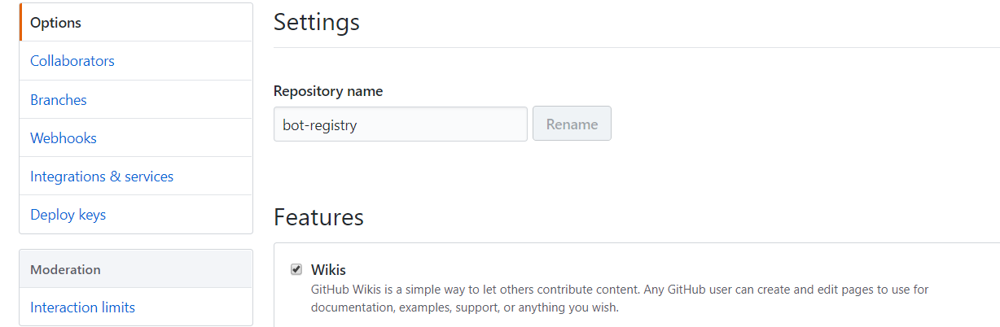
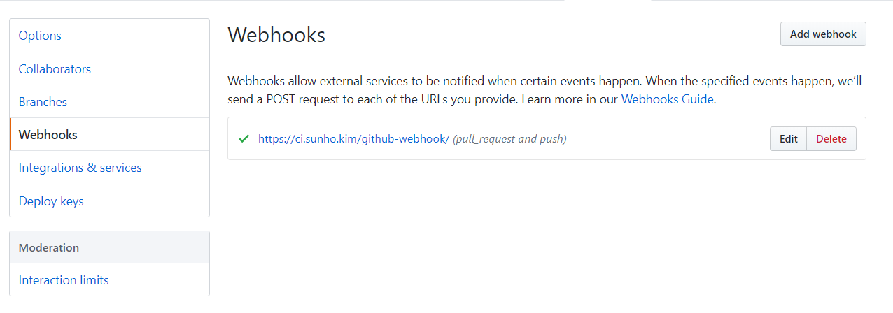
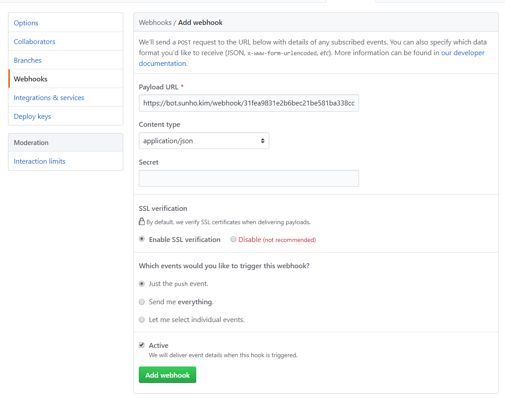
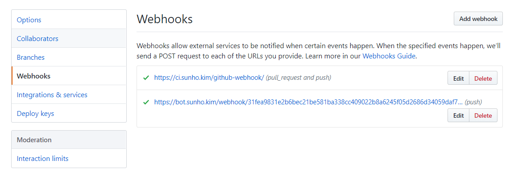

# 토큰

bot-registry는 토큰을 통해 사용자를 인식합니다. 토큰은 관리자만이 생성 및 재생성이 가능합니다. 만약 사용자 입장이시면 관리자에게 문의해주세요. 

# 봇

모든 작업은 bot-registry봇과의 DM을 통해 이루어집니다. bot-registry봇에게 DM으로 "help"를 전송해보세요. 

```
settoken <토큰> : 접근 토큰을 등록합니다.
gettoken : 등록된 접근 토큰을 출력합니다
webhook : 깃허브 웹훅 주소를 출력합니다
list : 보유중인 봇들의 정보를 출력합니다
stats <봇id> : 특정 봇의 상태를 출력합니다
build <봇id> : 특정 봇의 리빌드를 요청합니다
```

라는 메세지가 나와야 정상입니다. 만약 처음 bot-registry봇을 처음 사용하신다면 위에서 알아낸 토큰을 봇에게 알려주셔야 합니다. 

```
settoken 토큰
```

으로 토큰을 등록하세요. 이 과정이 진행된 후 다른 명령어 사용이 가능해집니다. 

# 깃헙 웹훅 등록

bot-registry는 깃헙 웹훅을 통해 깃헙 저장소에 변화가 생겼을 시 자동으로 빌드한 후 서버에 올려줍니다. 이를 위해서는 깃헙 저장소에서의 웹훅 등록이 필요합니다. 

먼저 list명령어를 통해 봇이 정상적으로 등록이 되어있나 확인해보세요. 

```
list
```
응답 예시
```
봇 리스트
0: test
https://github.com/sunho/test
```

여기서 나온 깃헙 저장소 주소가 봇의 깃헙 저장소를 제대로 가르키고 있는 지 확인해주세요. 그 뒤 webhook 명령어를 통해 웹훅주소를 출력시킵니다.

```
webhook
```
응답 예시
```
https://bot.sunho.kim/webhook/31fea9831e2b6bec21be581ba338cc409022b8a6245f05d2686d34059daf7d92
``` 

이 주소를 주소를 통째로 복사한 뒤 봇의 깃헙 저장소의 설정 페이지(레포주소/settings)에 들어가주세요. 


왼쪽 메뉴에 Webhooks를 눌러주세요.


Add webhook을 눌러주세요.


Payload URL에 아까 복사해둔 주소를 붙여넣고 Content type을 application/json으로 맞춰주세요. 그 뒤 Add webhook버튼을 눌러 웹훅을 추가한 뒤 다시 webhooks메인 화면에 보시면 정상적으로 작동하는지 웹훅 옆 체크 표시를 통해 확인하실 수 있습니다.


